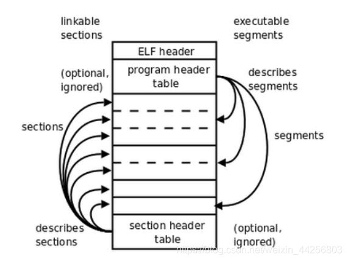

# PA3
## 2023.8.14
1. 加入CTE后，`R={GPR, PC}`扩充为`R={GPR, PC, SR}`
2. 加入CTE后，允许一条指令的执行会失败，引入虚构指令`raise_intr`，执行异常响应过程。若一条指令执行成功，其行为与TRM+IOE相同，若指令执行失败，其行为等价于执行了虚构指令`raise_intr`。给定状态机而任意状态S，`fex: S -> {0,1}`可以唯一地表示当前指令能否成功执行(由ISA确定fex(S))
3. riscv触发异常后**硬件响应**过程如下（简化），换而言之就是ecall指令的功能：
- 将当前PC值保存到mepc寄存器
- 在mcause寄存器中设置异常号(异常号通过a7(x17)寄存器传递)
- 从mtvec寄存器中取出异常入口地址
- 跳转到异常入口地址
4. riscv异常处理结束后通过`mret`指令从异常处理过程中返回，根据mepc寄存器恢复PC
5.  操作系统处理过程需要的信息：
- 引发执行流切换的原因 -> 抽象为Event
- 程序上下文(执行中程序的状态) -> 抽象为Context 
6. 上下文包括：
   - 通用寄存器
   - 触发异常时的PC和处理器状态
   - 异常号
   - 地址空间
  
## 2023.8.15
1. 操作系统的需求：
   - 能执行程序之间的执行流切换
   - 能加载用户程序
2. Loader函数需要解决的问题
   - 可执行文件在哪儿
   - 代码和数据在可执行文件的哪个位置
   - 代码和数据有多少
   - 正确的内存位置在哪里

## 2023.8.16
1. ELF组织可执行文件视角
   - 面向链接过程的section视角
   - 面向执行过程的segment视角
   
2. program header table 表项描述了segment的所有属性，包括类型、虚拟地址、标志、对齐方式、文件内偏移量和segment大小。
   通过segment的Type是否为LOAD来判断一个segment是否需要加载。
3. 操作系统为运行在其上面的程序提供运行时环境：作为资源管理者管理着系统中的所有资源，并为用户程序提供相应的服务(系统调用)
4. 运行时环境的两部分：
   - 操作系统内核区：访问系统资源的功能
   - 用户区：无需使用系统资源的功能+**系统调用接口**
5. 系统调用通过自陷指令实现，利用通用寄存器传递调用信息

## 2023.8.17
1. ecall是异常的一种，所以ecall有自己单独的Exception Code。
2. sys_exit是ecall的一种，所以sys_exit有自己单独的Syscall Number。
3. syscall流程
```
软件层面： __syscall__(int a, int b,...) <---------------------------                                                
               |(向寄存器中压入参数)                                  |
               |          （事件识别与分发） （系统调用号识别与分发）     |
操作系统层面     |            do_event() -----> do_syscall()--> syscal_xxx() 
               |                ^                          (执行真正的系统调用)
               v                |                                 
AM层面      调用ecall指令  _am_irq_handler()
               |                ^  (异常号识别与分发事件)
               v                |  
硬件层面： 执行ecall指令 ----> 执行mtvec部分
(修改CSR寄存器，PC跳转到mtvec)  (负责异常现场的保存与恢复)
```

## 2023.8.19
1. 利用`_end`管理程序结束段地址：通过`&_end`获取程序结束段地址，通过`_end=val`设置新程序结束段地址。(通过系统调用实现)
2. 文件描述符(fd)统一管理表示文件：一个文件描述符对应一个正在打开的文件，该映射关系由操作系统维护。
3. 操作系统通过`fopen()`系统调用管理文件描述符
4. 为了维护文件的偏移量，操作系统还需要使用`lseek()`提供偏移量调整功能
5. `FD_STDIN` fd = 0; `FD_STDOUT` fd = 1; `FD_STDERR` fd = 1;
6. 一定要认真看手册！！！每一句话都是有用的！！
7. `fs_read`和`fs_write`会在读到EOF时停止，此时返回值小于给定的`cnt`，换而言之，如果能读能写（还没到文件结尾）一定会读或者写！
8. 
9. 系统调用的功能由操作系统库函数提供，换而言之，客户程序通过系统调用使用操作系统的库函数，操作系统自身则完全能够直接使用该库函数，所以在这里有一层抽象
```
   NEMU < - > OS < - > guest program
   ^                           |      这里的库函数调用链为 fs_read() -> ramdisk_read()
   |-- OS库函数 < -- 系统调用 <---      正是由于ramdisk提供了接口，才让读取文件变得方便
```  
11. 实际上是系统调用在内核中的实现（系统调用内部调用这些内核函0、） 
12. 复盘debug
```
fs_read()位置 首先对fs_read()的抽象层次不清楚 -> 瞎写了_read()和sys_read() 其次妄图从navy中extern到nano-lite中 其实static已经暗示了函数要在fs.c中写
fs_read()实现 首先对manual没理解清楚 -> 瞎写了判断 -> 测试读取有误 -> 臆想了会缩小read的len再次操作（但是实际情况没有出现，此时本应该警醒，但是没有）->报错
```

## 8.20
1. 为什么可以“一切皆文件”？ -> 计算机系统中到处都是字节序列，文件本身也是字节序列
2. 一切皆文件的好处？ -> 为不同的事务提供了统一的接口，**使用文件的接口来操作计算机上的一切**
3. 真实文件系统指具体如何操作某一类文件（包括管理普通文件的NTFS，EXT4；和管理特殊文件的procfs,devfs, initramfs等），这些文件系统都分别实现了对这些文件的**具体操作方式**
4. VFS(虚拟文件系统)之对不同种类的真是文件系统的抽象，利用API描述真实文件系统的抽象行为
5. `Finfo`结构体中的`ReadFn`和`WriteFn`指向该文件类型的真正进行读写的函数
6. 具有位置概念的文件支持`lseek`操作，由”块设备“存储；没有位置概念的文件不支持`lseek`操作，由”字符设备“存储
7. “每隔x秒”这种行为不能用`=`去判断，因为**不能保证在那个时间点读到数据**，而应该用`<`去判断第一次超过时间点
8. 系统屏幕(frame buffer) -- 画布(Canvas) -- 绘制区域(Rect) 之间的关系
```
   (0,0)--------------------
   |(a,b)------            | 
   |  |  []   |            | 
   |  |       |            | 
   |  |-------| (*w+a,*h+b)|
   |                       |
   -------------------------(x,y)
   系统屏幕 (0,0) <-> (x,y) 大小取决于NEMU模拟硬件实现
   画布 (a,b) <-> (*w+a,*h+b) 大小位置取决于NDL_OpenCanvas
   绘制 (x,y) <-> (w,h) 位置和区域取决于在NDL_DrawRect
```
9. 从"/proc/dispinfo"中读出屏幕大小 -> 抽象接口 这里调用dispinfo_read()

## 8.21
1. 定点算术：通过定点数表示实数，并利用整数运算来实现定点运算
2. 定点表示法具有固定位数的整数和小数部分；浮点表示法通过`mantissa`记录数字，通过`exponent`记录小数点的位置
3. fixedpt类型为一32bit数据，0~7表示小数部分，8~31为整数部分，最高位为符号位 
4. 对于实数a，其fixedpt类型表示为A = a * 2^8

## 8.22
1. 神奇的fixedpt_rconst()，为什么编译结果来看没有任何浮点指令：首先这是一个宏，其次送入的是一个常量，FIXEDPT_ONE用于fixed化数字（实际上就是乘了2^8）后面的+-0.5是用于补充精度的，最后通过运算直接转化为一个fixedpt(int_32)类型的表示。换而言之，所有的**浮点计算和转化过程是编译器做的**，程序只会得到一个fiedpt类型的数据表示。
2. C语言中浮点常量默认是double类型
3. lseek等文件操作都是以Byte作为单位的，vga的读写却是以一个像素为单位(4Bytes)，所以这里有额外的映射处理逻辑。
4. Wine通过Linux的运行时环境实现Windows相关的API,WSL通过Windows的运行时实现Linux相关的API
